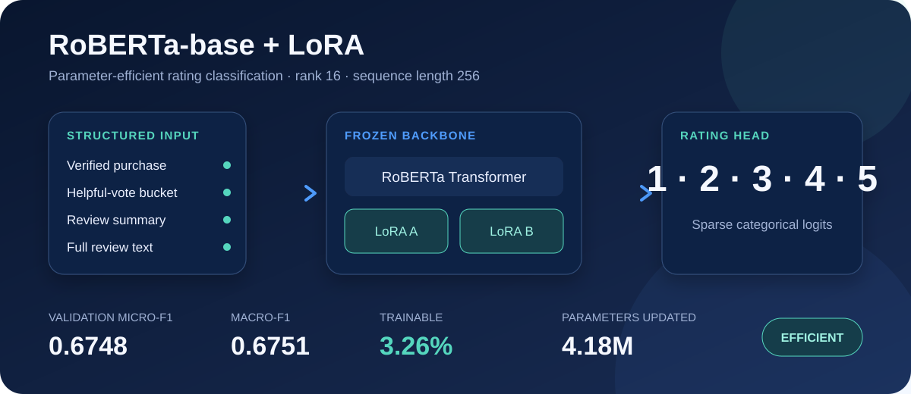
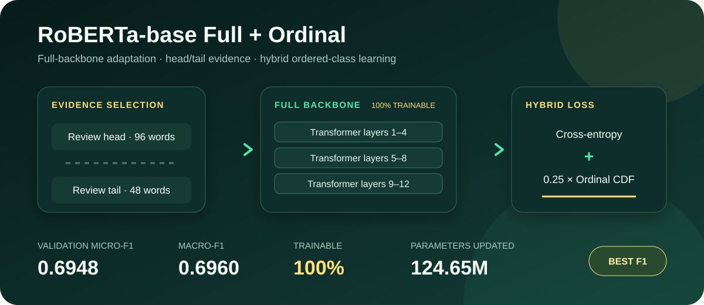
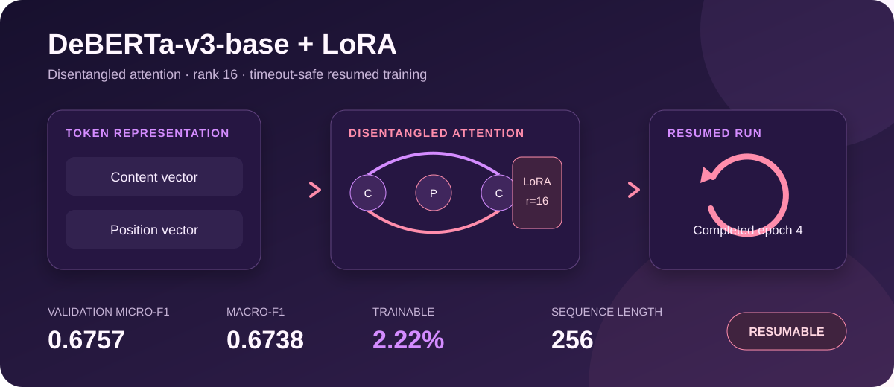

# Amazon Review Rating Prediction

End-to-end analysis and five-class rating prediction for Amazon electronics reviews. The project predicts the exact `overall` score from **1 to 5** using review text and lightweight review metadata.

The official metric is **micro-averaged F1**. In this single-label multiclass problem, micro-F1 is equal to accuracy. Macro-F1 is also reported to expose performance differences between ratings.

## Live project presentation

Explore the complete data story, modelling pipeline, experiment comparison and final submission contract in the public presentation site:

**[Amazon Review Intelligence](https://amazon-review-intelligence.ma-slri2128.chatgpt.site)**

The site source lives in [`presentation/`](presentation/) and can be developed locally with Node.js 22 using `npm install` and `npm run dev`.

## Current status

The complete modelling workflow is available:

```text
EDA
→ Transformer-safe preprocessing
→ balanced train/validation construction
→ RoBERTa LoRA
→ RoBERTa full fine-tuning with ordinal loss
→ DeBERTa-v3 LoRA with timeout-safe resume
→ validation reproduction
→ test inference
→ q2_submission.csv
```

All three Transformer experiments were completed on the same balanced validation set. The strongest completed model is **RoBERTa-base full fine-tuning with hybrid ordinal loss**.

## Dataset

The raw training dataset contains **838,944 reviews**. Its relevant columns are:

| Column | Purpose |
|---|---|
| `overall` | Target rating from 1 to 5 |
| `reviewText` | Main review text |
| `summary` | Short review title |
| `verified` | Verified-purchase status |
| `vote` | Helpful-vote count |
| `asin` | Product identifier used to join metadata |

Product metadata supplies `title` and `brand`. The untouched test dataset contains **20,000 rows** without `overall`.

Published Kaggle datasets:

- [Raw Amazon review sentiment dataset](https://www.kaggle.com/datasets/maslri/amazon-review-sentiment-dataset)
- [Balanced 50,000-per-class Transformer dataset](https://www.kaggle.com/datasets/maslri/balanced-50000)

Raw CSV files are intentionally ignored by Git. For local work, place them under `data/raw/`:

```text
data/raw/
├── train_data.csv
├── test_data.csv
└── title_brand.csv
```

## Preprocessing

The Transformer preprocessing keeps information that may affect sentiment:

- removes HTML and URLs;
- normalizes whitespace;
- preserves punctuation, case, numbers, emoji, stopwords and negation;
- retains missing helpful-vote values and represents them as `missing`;
- buckets helpful votes into interpretable ranges;
- limits summaries to 40 words;
- joins product metadata by `asin`;
- keeps the official test-row order unchanged.

The structured base input is:

```text
Verified: ... | Helpful votes: ... | Summary: ... | Review: ...
```

The balanced experiment contains 50,000 rows per rating:

| Split | Rows | Rows per class |
|---|---:|---:|
| Train | 240,000 | 48,000 |
| Validation | 10,000 | 2,000 |
| Test | 20,000 | Unlabelled |

Preprocessing components are fitted only on training data. Validation and test are not used for fitting or model selection leakage.

## Model experiments

### RoBERTa-base with LoRA

The parameter-efficient baseline uses rank-16 KerasHub LoRA adapters, sequence length 256, AdamW, mixed precision, warmup, cosine decay and resumable checkpoints.

<p align="center">
  
</p>

### RoBERTa-base full + ordinal

The full model updates the complete backbone. Its loss combines sparse categorical cross-entropy with an ordinal CDF-distance term so that the ordering `1 < 2 < 3 < 4 < 5` contributes to learning.

Long reviews retain both their beginning and ending before tokenization. This helps preserve final recommendations or conclusions that would otherwise be lost by simple right-side truncation.

<p align="center">
  
</p>

### DeBERTa-v3-base with LoRA

The DeBERTa run uses rank-16 adapters and the same balanced split. Its first Kaggle session exceeded the runtime limit during epoch 3. `BackupAndRestore` state was attached to a fresh session, and training resumed through epoch 4 without restarting the experiment.

<p align="center">
  
</p>

The executed continuation is stored at:

```text
notebooks/implemented/deberta_v3_resume.ipynb
```

## Validation results

| Model | Strategy | Trainable parameters | Micro-F1 | Macro-F1 |
|---|---|---:|---:|---:|
| RoBERTa-base LoRA | Rank-16 adapters | 4,176,389 (3.26%) | 0.6748 | 0.6751 |
| DeBERTa-v3-base LoRA | Rank-16 adapters, resumed | 4,176,389 (2.22%) | 0.6757 | 0.6738 |
| **RoBERTa-base Full + Ordinal** | **Full backbone** | **124,647,173 (100%)** | **0.6948** | **0.6960** |

Per-class results for the strongest model:

| Rating | Precision | Recall | F1 |
|:---:|---:|---:|---:|
| 1 | 0.7659 | 0.7410 | 0.7532 |
| 2 | 0.5848 | 0.6395 | 0.6109 |
| 3 | 0.6190 | 0.6215 | 0.6203 |
| 4 | 0.6891 | 0.6605 | 0.6745 |
| 5 | 0.8310 | 0.8115 | 0.8211 |

Ratings 2–4 remain hardest because adjacent star ratings often use overlapping or mixed language.

> These metrics use an artificially balanced validation set. Before treating them as expected production performance, evaluate on a separate leakage-free validation set that preserves the raw rating distribution.

## Kaggle model artifacts

- [RoBERTa Full + Ordinal](https://www.kaggle.com/models/yasin86/roberta-keras-full-ordinal)
- [RoBERTa LoRA](https://www.kaggle.com/models/maslri/roberta-lora-keras)
- [DeBERTa-v3 LoRA](https://www.kaggle.com/models/alisalari76/deberta-v3-keras)

Large weights and Kaggle working directories are deliberately excluded from this repository.

## Notebook roadmap

| Notebook | Purpose |
|---|---|
| `01_eda.ipynb` | Dataset exploration and quality checks |
| `02_preprocessing.ipynb` | Local balanced preprocessing |
| `02_preprocessing_kaggle.ipynb` | Kaggle dataset-builder version |
| `03_roberta_keras.ipynb` | Full RoBERTa + ordinal training template |
| `04_deberta_v3_keras.ipynb` | Initial DeBERTa LoRA training |
| `05_roberta_lora_test_inference_submission.ipynb` | RoBERTa LoRA inference |
| `06_deberta_v3_resume.ipynb` | DeBERTa resume template |
| `07_roberta_full_test_inference_submission.ipynb` | Full RoBERTa inference |
| `08_deberta_v3_test_inference_submission.ipynb` | DeBERTa inference |

Executed notebooks with their saved outputs are kept in `notebooks/implemented/`.

## Submission contract

Every inference notebook first reproduces the model's known validation score. Test inference runs only after this audit passes.

The official output is:

```text
q2_submission.csv
└── predicted
```

Required assertions:

```python
assert len(submission) == 20_000
assert submission.columns.tolist() == ["predicted"]
assert submission["predicted"].between(1, 5).all()
assert not submission["predicted"].isna().any()
```

The row order remains identical to the original test CSV, and the file is written without an index.

## Repository structure

```text
.
├── assets/models/         # Model architecture and result illustrations
├── data/                  # Raw and generated CSVs are ignored
├── docs/                  # Preprocessing decisions and validation notes
├── notebooks/
│   └── implemented/       # Executed model notebooks and outputs
├── models/                # Local weights are ignored
├── reports/               # Reusable report assets
├── src/                   # Loading, preprocessing, features and evaluation
├── requirements.txt       # Local environment snapshot
├── requirements-kaggle.txt
└── README.md
```

## Environment

Create and activate a local virtual environment:

```powershell
python -m venv .venv
.venv\Scripts\Activate.ps1
pip install -r requirements.txt
```

The Transformer notebooks were run with the versions recorded in `requirements-kaggle.txt`. Kaggle already provides most GPU packages; avoid partially upgrading its TensorFlow/Keras stack during a running experiment.

## Reproducibility controls

- random seed `42`;
- deterministic TensorFlow operations;
- fixed validation membership;
- sequence length 256;
- periodic and best checkpoints;
- `BackupAndRestore` for interrupted sessions;
- validation-score reproduction before test inference;
- test-row-order and submission-schema assertions.

Exact reproduction also requires the same Kaggle dataset/model versions and compatible TensorFlow, Keras and KerasHub packages.

## Remaining limitations

- The balanced validation set does not represent the original class distribution.
- Future splits should group by normalized review-text hash to prevent repeated text crossing split boundaries.
- Balanced sampling should be compared with class-weighted training on the full dataset.
- Duplicate Transformer notebook logic can move into `src/` now that experiments are complete.
- Automated tests should cover preprocessing invariants and submission integrity.

## License

This project is licensed under the MIT License.
